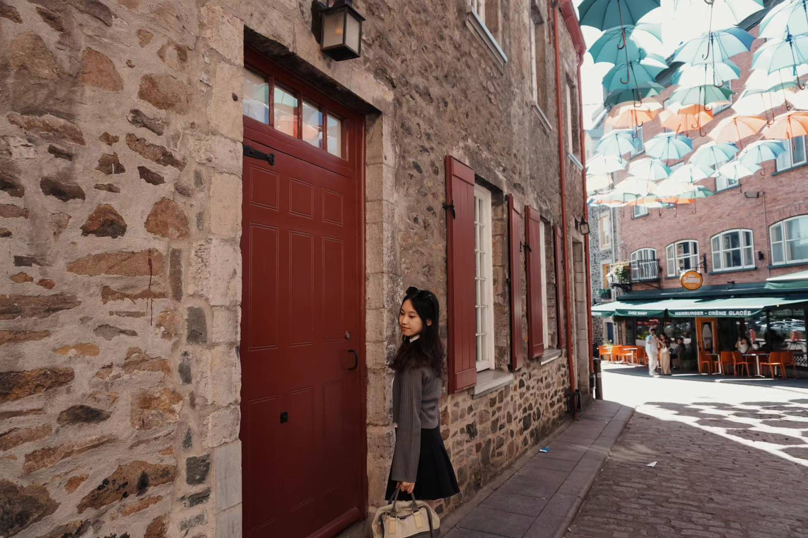

Welcome to my website! I'm Yuying Lu and this is me.

.  

I love travel and this is a photo taken in Quebec City in Canada. One of my hobbies is photography and I enjoy taking pictures of beautiful scenery in different places. If you're interested in sharing your experience in travel or photography with me, you can contact me via my email on the navigation bar.

This website contains other two pages:

- **CV page:** it briefly summarizes my academic and professional experience, helping people know more about my academic background. 
- **Dashboard:** it shows three different types of plots based on data NY NOAA loaded from package `p8105.datasets`.
 

